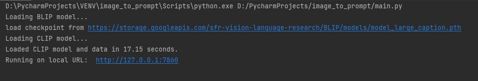
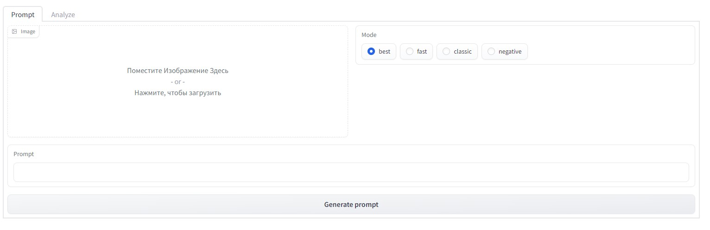
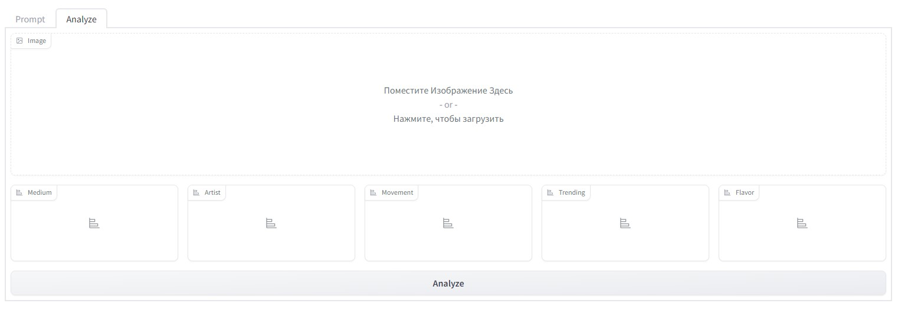
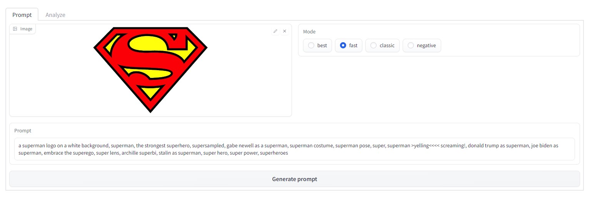
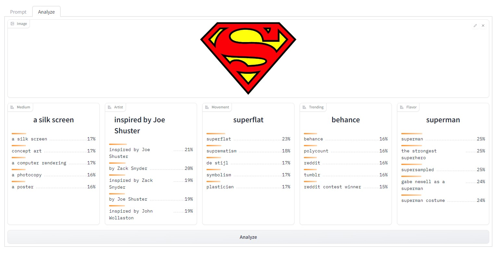
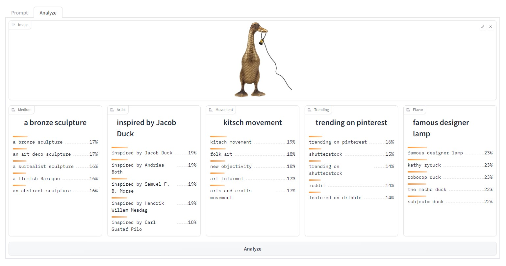
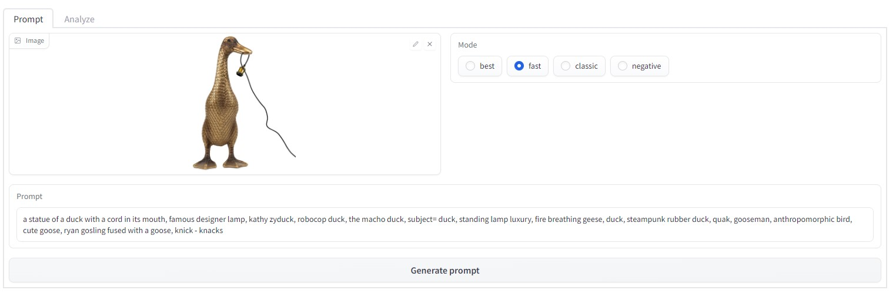
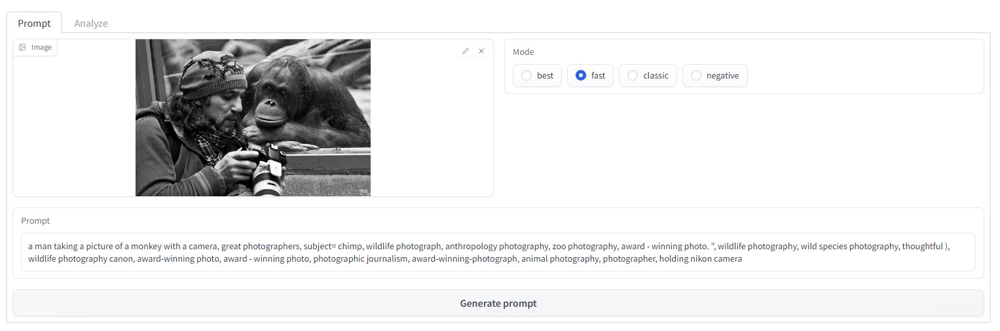
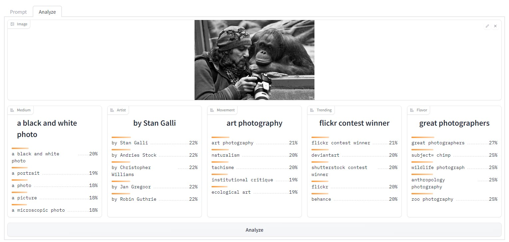

<p>
  
  
  
  
  
  
  
  
  
</p>
<div align="center">


# Image to Prompts

</div>


It's very simple: 
## Order of preparation and work

1. Clone the repository or download the archive from github or using the following commands on the command line
    ```command line
    $cmd
    $ git clone https://github.com/BEPb/image_to_prompt
    $ cd image_to_prompt
    ```

2. Create a Python virtual environment.
3. Install all necessary packages for our code to work using the following command:

     ```
     pip install -r requirements.txt
     ```

Check GPU
```commandline
 nvidia-smi -L
```

run the main python program


after which a local server will be launched on your computer, follow the link (open in any browser)

this page has two tabs (prompt and analyze) and additional settings that affect the speed of recognition and the result

on each of the tabs, to start the analysis, you need to select a picture on your PC and click on the button 
"Generate prompt"

or button "Analyze"







